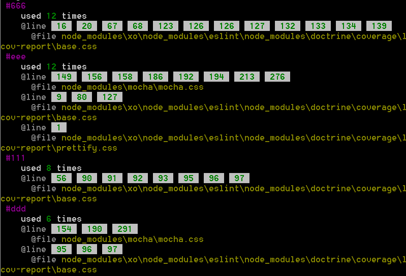

# css-colors


## Install

```
$ npm install --save csscolors
```


## Usage

```js
var csscolors = require('csscolors');

csscolors('css/foo.css', function(err, colors){
	//extract colors from file
});
```

```js
var csscolors = require('csscolors');

csscolors('css/**/*.*', function(err, colors){
	//extract colors from directory
});
```


## API

### csscolors(cssContent, callback)

* `cssContent` {String}
* `callback` {Function}
  * `colors` {Array<Object>} contains color and its line number


## CLI

```
$ npm install --global csscolors
```

```
$ csscolors ./
$ csscolors path/to/css/file.css
```


##CLI Example
```
$ csscolors ./
```



## License

MIT © [fengzilong](https://github.com/fengzilong)
